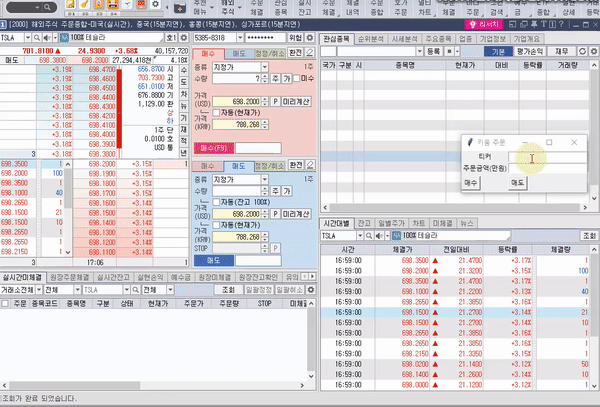

# Upbit, Binance, Kiwoom HTS Macro Auto Click
by 서석범

Upbit, Binance, and Kiwoom HTS Auto Click projects were created to build more accurate, faster, and simpler auto-click systems for virtual currency and stock trading.  
Upbit, Binance, Kiwoom HTS Auto Click 프로젝트는 가상 화폐 및 주식 매매 하는데에 있어서, 더 정확하고 더 빠르고 더 간편한 자동 클릭 시스템을 구축하기 위해서 만들었습니다.

## 프로젝트 계기
Using Upbit, Binance, and Kioom Korean Home trading systems(like robinhood), I felt uncomfortable to buy exact amount of stocks at a appropriate price quickly. For example, when the amount we want to buy is 1,000 dollar, we enter the order price and amount we want to buy. We should calculate the amount of the stocks manually on the calculator. The second inconvenience is that in times of high volume and volatility, stock or bitcoin price changes dramatically in one to or minutes during entering the buying order. It often resulted in a loss. Using Python's auto click system, we have completed the sold order within one second to prevent the loss of slipage cost.  
업비트, 바이낸스, 키움증권을 이용하면서, 정확히 원하는 금액을 유리한 가격에 빠르게 매수하는 데에 불편함을 느꼈습니다. 예를 들어 매수하고 싶은 금액이 100만 원일 때에, 원하는 한 주에 대한 주문 가격을 입력하고 몇 주를 살 건지 입력하는 과정에서, 100만 원이 몇 주에 해당하는지 계산기로 수동으로 계산해야 한다는 불편함이 있었고, 원하는 금액을 입력하면 현재가에서 가장 유리한 가격으로 매수를 해주는 시스템을 만들었습니다. 두 번째 불편함은 거래량과 변동성이 큰 시간대일수록 주문을 입력하는 1~2분 동안 가격이 크게 변하여 주문을 작성하기 시작했던 때와 상황이 달라져 매매에 손해를 보는 경우가 종종 생겼습니다. 파이썬의 auto click 시스템을 사용하여 1초 안에 매매 주문을 마무리하여 주문 금액에 슬리피지 손실이 발생하지 않도록 하였습니다.

## Upbit Macro Bot | 업비트 매크로

### Main Features | 주요 기능
## Upbit Macro Bot | 바이낸스 매크로

### Main Features | 주요 기능

## Upbit Macro Bot | 바이낸스 매크로

### Main Features | 주요 기능   
<!--  -->